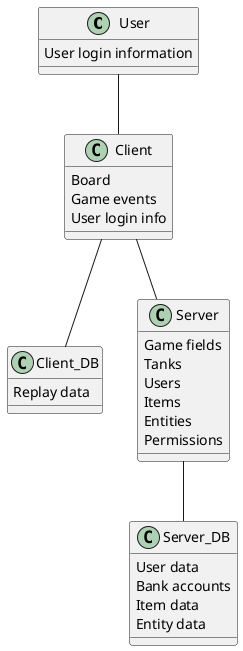

```plantuml
@startuml
class User {
User login information
}

class Client {
Board
Game events
User login info
}

class Client_DB {
Replay data
}

class Server {
Game fields
Tanks
Users
Items
Entities
Permissions
}

class Server_DB {
User data
Bank accounts
Item data
Entity data
}

User -- Client
Client -- Client_DB
Client -- Server
Server -- Server_DB
@enduml
```

- [ ] Do #4
