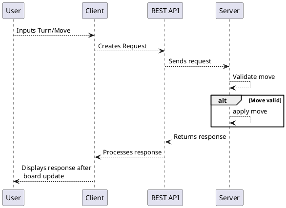

```plantuml
@startUML

User --> Client: Inputs Turn/Move
Client --> "REST API": Creates Request
"REST API" --> Server: Sends request
Server --> Server: Validate move
alt Move valid
Server --> Server: apply move
end
Server --> "REST API": Returns response
"REST API" --> Client: Processes response
Client --> User: Displays response after\n board update
@endUML
```
